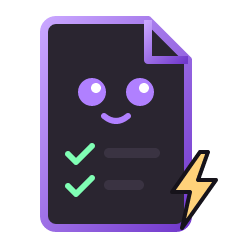
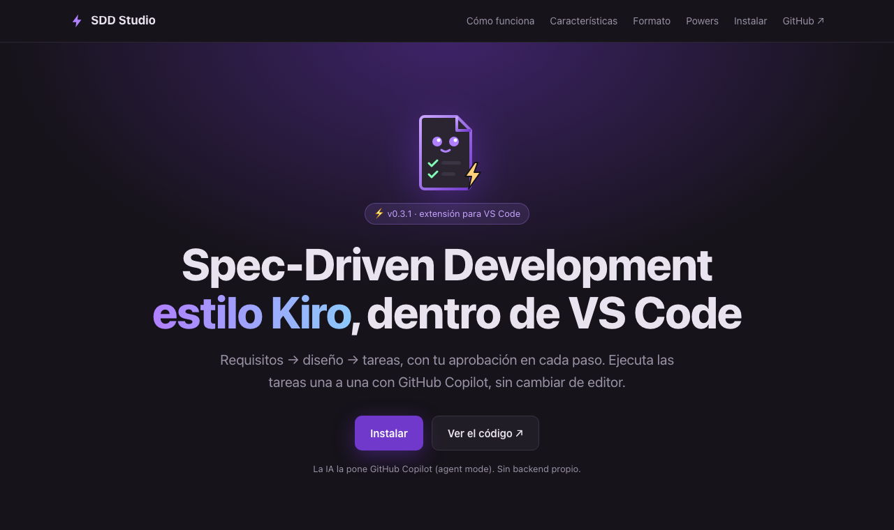
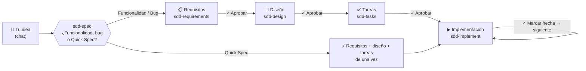
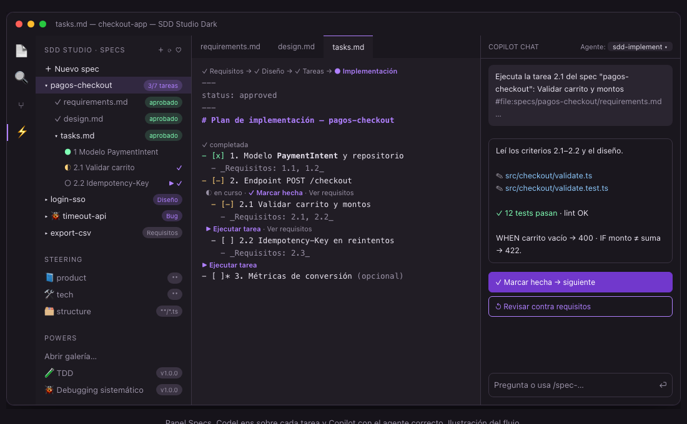
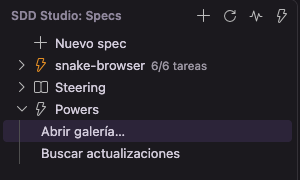
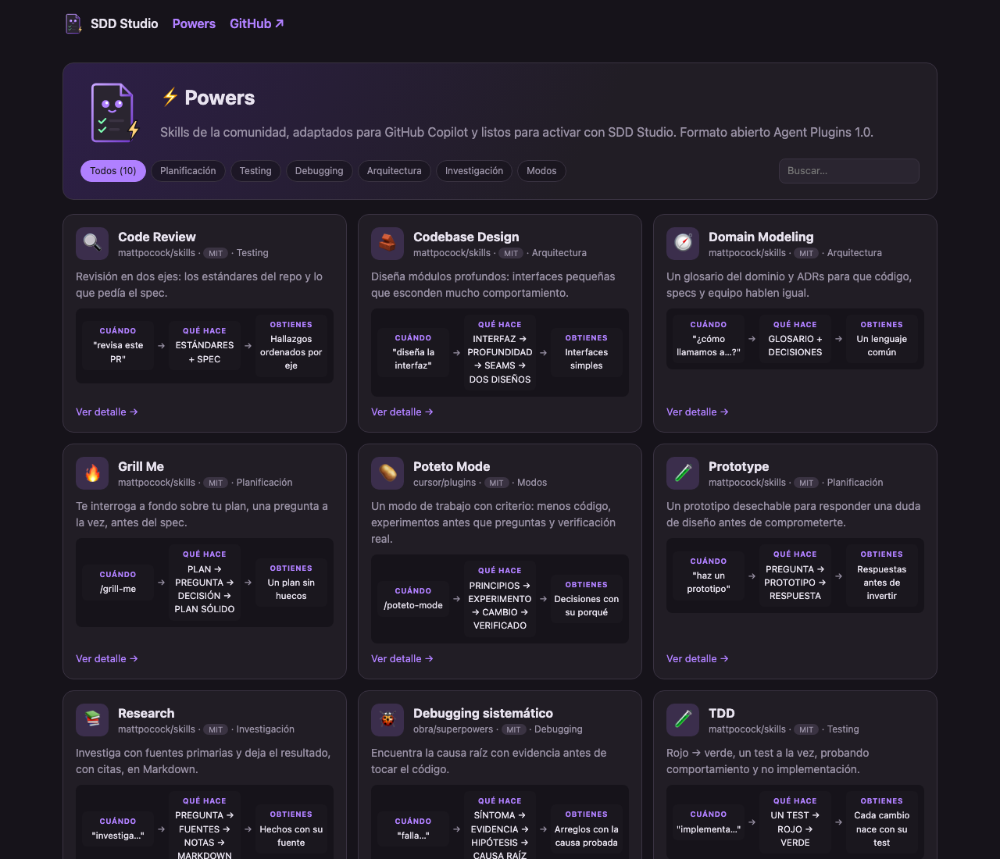
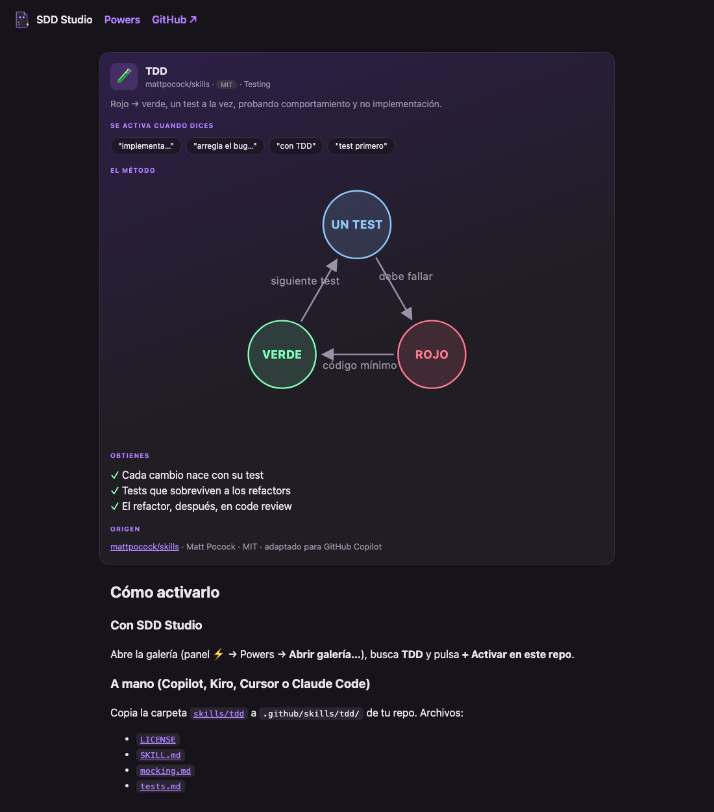
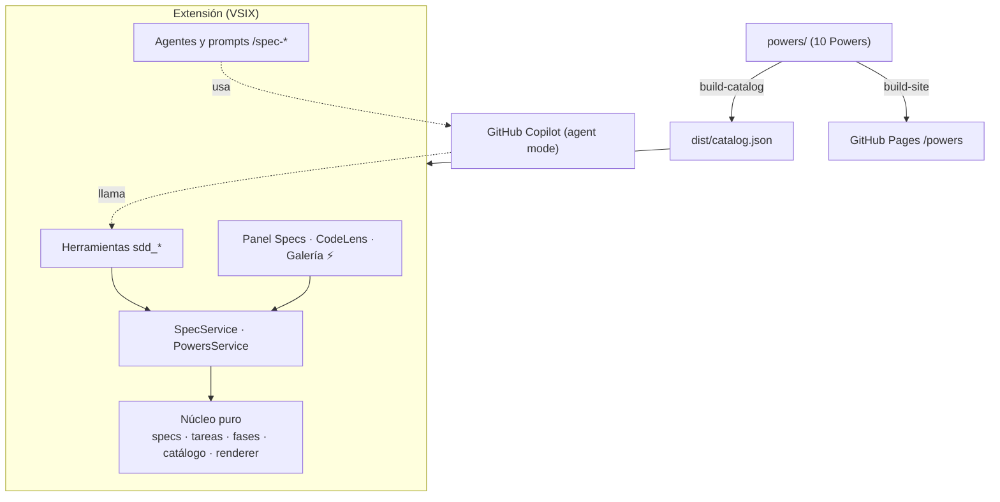

<p align="center">
  
</p>

<h1 align="center">SDD Studio</h1>

<p align="center">
  <b>Spec-Driven Development estilo Kiro, dentro de VS Code.</b><br>
  Requisitos → diseño → tareas, con tu aprobación en cada paso. La IA la pone GitHub Copilot.
</p>

<p align="center">
  <a href="https://github.com/enriquecordero/sdd-studio/releases/latest"></a>
  <a href="https://github.com/enriquecordero/sdd-studio/actions/workflows/ci.yml"></a>
  <a href="LICENSE.md"></a>
  
  
</p>

<p align="center">
  <a href="https://enriquecordero.github.io/sdd-studio/"><b>🌐 Landing</b></a> ·
  <a href="https://enriquecordero.github.io/sdd-studio/powers/"><b>⚡ Catálogo de Powers</b></a> ·
  <a href="#-cómo-usar-cada-power"><b>🎯 Cómo usar cada Power</b></a> ·
  <a href="https://github.com/enriquecordero/sdd-studio/releases/latest"><b>⬇️ Descargar el .vsix</b></a>
</p>

<p align="center">
  
</p>

---

## ✨ ¿Qué es?

- **Specs como en Kiro, sin cambiar de editor.** Escribes tu idea en el chat y SDD Studio la convierte en `requirements.md` → `design.md` → `tasks.md`, y luego en código, tarea por tarea.
- **Tú apruebas cada fase.** Nada avanza sin tu clic, y las aprobaciones las aplica la extensión con código, no el modelo.
- **100 % GitHub Copilot.** Usa los modelos de tu plan (también Business o Enterprise) mediante custom agents, prompt files, skills y herramientas de extensión, todas funciones GA. Sin backend propio.
- **Powers.** Una galería de skills populares de la comunidad (TDD, debugging, code review…) adaptados a Copilot, que activas por repo con un clic.

## 🧭 Cómo funciona



1. Pulsa **+ Nuevo spec** en el panel ⚡, o elige el agente **`sdd-spec`** en Copilot Chat, y escribe tu idea, por ejemplo *"quiero hacer el juego de Snake"*.
2. `sdd-spec` te pregunta el tipo con una **tarjeta** (*Construir una funcionalidad*, *Arreglar un bug* o *Quick Spec*), elige el nombre del spec y delega en **subagentes**.
3. Revisa cada documento y apruébalo con el botón del chat, la CodeLens **✓ Aprobar y continuar** o el panel.
4. En `tasks.md`, pulsa **▶ Ejecutar tarea**. `sdd-implement` escribe el test primero, implementa y verifica. Luego pulsa **✓ Marcar hecha → siguiente**.

<p align="center">
  <br>
  <sub>Ilustración del flujo: panel Specs, CodeLens sobre cada tarea y Copilot con el agente correcto.</sub>
</p>

<table>
<tr>
<td width="320"></td>
<td>

**El panel ⚡ SDD Studio** (captura real):

- **Nuevo spec**, y tus specs con su fase o su progreso (*6/6 tareas*).
- **Steering**: las instrucciones `product`, `tech` y `structure` de Copilot.
- **Powers**: la galería y los Powers activos en el repo.
- En la barra de título: crear, refrescar, **Diagnóstico** y la galería de Powers.

</td>
</tr>
</table>

### 🤖 Los agentes

| Agente | Qué hace | Botón al terminar |
|---|---|---|
| `sdd-spec` | Punto de entrada: pregunta el tipo, elige el nombre y orquesta subagentes | ✓ Aprobar requisitos → Diseño |
| `sdd-requirements` | Requisitos con historias y criterios **EARS** (`WHEN … THE SYSTEM SHALL …`), o `bugfix.md`. Wireframes ASCII si hay interfaz | ✓ Aprobar requisitos → Diseño |
| `sdd-design` | Arquitectura, interfaces, datos, errores y tests, con diagramas ASCII | ✓ Aprobar diseño → Tareas |
| `sdd-tasks` | Tareas pequeñas trazadas a los requisitos (`_Requisitos: 1.1_`) | ✓ Aprobar tareas → Implementar |
| `sdd-implement` | Una tarea por vez: test primero, código mínimo, verificación real | ✓ Marcar hecha → siguiente |
| `sdd-steering` | Genera `product`, `tech` y `structure` en `.github/instructions/` | — |

Los agentes de requisitos, diseño y tareas **no pueden tocar tu código**: solo escriben documentos de spec mediante la herramienta `sdd_writeSpecDoc`.

Las reglas de cada agente y su fuente: [`docs/agents.md`](docs/agents.md).

### 💬 Atajos en el chat

| Comando | Para qué |
|---|---|
| `/spec-new <idea>` | Spec de funcionalidad |
| `/spec-bugfix <qué falla>` | Spec de bug (bug actual → esperado → regresión) |
| `/spec-quick <idea>` | Quick Spec: todo de una vez, listo para implementar |
| `/spec-run <spec> <tarea>` | Ejecuta una tarea concreta |
| `/spec-steering` | Genera o actualiza el steering del proyecto |

## ⚡ Powers

Skills populares de la comunidad, **adaptados a GitHub Copilot** y presentados con una infografía. Cada Power se instala en `.github/skills/<id>/` de tu repo (con su `LICENSE`) y queda registrado en `.github/powers.lock.json`, así que tu equipo lo recibe por git.

<p align="center">
  
</p>

| | Power | Categoría | Autor original | Se activa |
|---|---|---|---|---|
| 🧪 | [TDD](https://enriquecordero.github.io/sdd-studio/powers/tdd.html) | Testing | Matt Pocock | Automático ("implementa…", "con TDD") |
| 🐞 | [Debugging sistemático](https://enriquecordero.github.io/sdd-studio/powers/systematic-debugging.html) | Debugging | Jesse Vincent (superpowers) | Automático ("falla…", "error") |
| ✅ | [Verificación](https://enriquecordero.github.io/sdd-studio/powers/verification.html) | Testing | Jesse Vincent (superpowers) | Automático ("ya está", "listo") |
| 🔥 | [Grill Me](https://enriquecordero.github.io/sdd-studio/powers/grill-me.html) | Planificación | Matt Pocock | **`/grill-me`** |
| 🧪 | [Prototype](https://enriquecordero.github.io/sdd-studio/powers/prototype.html) | Planificación | Matt Pocock | Automático ("haz un prototipo") |
| 📚 | [Research](https://enriquecordero.github.io/sdd-studio/powers/research.html) | Investigación | Matt Pocock | Automático ("investiga…") |
| 🧭 | [Domain Modeling](https://enriquecordero.github.io/sdd-studio/powers/domain-modeling.html) | Arquitectura | Matt Pocock | Automático ("escribe un ADR") |
| 🔍 | [Code Review](https://enriquecordero.github.io/sdd-studio/powers/code-review.html) | Testing | Matt Pocock | Automático ("revisa este PR") |
| 🧱 | [Codebase Design](https://enriquecordero.github.io/sdd-studio/powers/codebase-design.html) | Arquitectura | Matt Pocock | Automático ("diseña la interfaz") |
| 🥔 | [Poteto Mode](https://enriquecordero.github.io/sdd-studio/powers/poteto-mode.html) | Modos | Lauren Tan (pstack) | **`/poteto-mode`** |

<table>
<tr>
<td width="460"></td>
<td>

**Cada Power tiene su póster:**

- **Se activa cuando dices:** las frases que lo cargan.
- **El método:** un diagrama (ciclo, pasos, embudo o dos columnas).
- **Obtienes:** los beneficios.
- **Origen:** repo, autor y licencia, con enlace al commit exacto.

**Usarlos:** panel ⚡ → Powers → **Abrir galería…** → **+ Activar en este repo**.
**Actualizar:** **Buscar actualizaciones** (opcional; sin red se usa el catálogo incluido). Si editaste un skill a mano, SDD Studio pregunta antes de sobrescribirlo o borrarlo.

</td>
</tr>
</table>

> Formato abierto **Agent Plugins 1.0**: los Powers también sirven en Kiro, Cursor o Claude Code copiando la carpeta del skill. Cada página del [catálogo](https://enriquecordero.github.io/sdd-studio/powers/) explica cómo.

### 🎯 Cómo usar cada Power

Primero **actívalo** en tu repo: panel ⚡ → Powers → **Abrir galería…** → **+ Activar en este repo**. Una vez activo, Copilot lo carga **automáticamente** cuando tu petición encaja con la descripción del skill; también puedes invocar cualquier Power activo a mano con `/<id>` en Copilot Chat. **Grill Me** y **Poteto Mode** son la excepción: solo funcionan si los invocas explícitamente (`/grill-me`, `/poteto-mode`).

<details>
<summary><b>🧪 TDD</b> — Rojo → verde, un test a la vez, probando comportamiento y no implementación</summary>

**Cuándo usarlo:** al construir una funcionalidad o arreglar un bug test-first, o cuando quieres tests de integración que sobrevivan a los refactors.

**Cómo activarlo:** automático con frases como "implementa con TDD", "test primero", "rojo verde refactor", "arregla el bug con un test". O explícito: `/tdd`.

**Ejemplo:**
```text
Implementa con TDD el movimiento de la serpiente en Snake: que avance una casilla por tick y no pueda girar 180°.
```

**Qué hace el agente:**
1. Lee `GLOSSARY.md` (si existe) y los ADR de la zona para usar el vocabulario del proyecto.
2. Te propone la interfaz pública y los **seams** a testear, y espera tu confirmación: no escribe tests en seams sin confirmar.
3. Escribe **un** test que falla (rojo) a través de la interfaz pública.
4. Escribe solo el código mínimo para que pase (verde), sin anticipar futuros tests.
5. Repite en rebanadas verticales (un test → una implementación), evitando tests acoplados a internos o tautológicos. Solo hace mock en los límites del sistema (APIs externas, tiempo, etc.).

**Obtienes / Consejo:** cada cambio nace con su test. El refactor **no** forma parte del bucle: se hace en la revisión (`code-review`). En SDD encaja en **▶ Ejecutar tarea**.
</details>

<details>
<summary><b>🐞 Debugging sistemático</b> — Causa raíz con evidencia antes de proponer ningún arreglo</summary>

**Cuándo usarlo:** ante cualquier bug, test rojo, error de build o comportamiento inesperado, sobre todo si hay prisa o ya probaste arreglos que no funcionaron.

**Cómo activarlo:** automático con "falla…", "tengo un error", "el test está rojo", "no funciona", "encuentra la causa raíz". O explícito: `/systematic-debugging`.

**Ejemplo:**
```text
El checkout falla al importar un CSV con comas dentro de un campo entrecomillado. Encuentra la causa raíz antes de arreglar nada.
```

**Qué hace el agente:**
1. **Investiga la causa raíz:** lee el error completo, reproduce, revisa cambios recientes y, si hay varios componentes, añade trazas en cada frontera para ver dónde se rompe.
2. **Analiza patrones:** compara código que funciona con el que falla y lista cada diferencia.
3. **Formula una hipótesis** concreta y la prueba con el cambio más pequeño posible, una variable a la vez.
4. **Implementa:** crea primero un test que falle (con `tdd`), aplica un único arreglo y lo verifica (con `verification`).
5. Si fallan 3 arreglos seguidos, **se detiene y cuestiona la arquitectura** contigo en vez de intentar un cuarto.

**Obtienes / Consejo:** arreglos que atacan la causa y no el síntoma. En SDD, úsalo con un spec de bug (`/spec-bugfix`) o cuando una tarea de implementación se atasca.
</details>

<details>
<summary><b>✅ Verificación</b> — Nada está "listo" sin ejecutar la comprobación y leer su salida</summary>

**Cuándo usarlo:** antes de afirmar que algo está terminado, arreglado o pasando, y antes de hacer commit o abrir un PR.

**Cómo activarlo:** automático al decir "ya está", "funciona", "terminé", "listo para el PR", "¿pasan los tests?". O explícito: `/verification`.

**Ejemplo:**
```text
Creo que el Snake ya está. Verifica que todo pasa antes de abrir el PR.
```

**Qué hace el agente:**
1. Identifica qué comando prueba cada afirmación (tests, linter, build…).
2. Lo ejecuta completo y de nuevo, no se fía de ejecuciones previas.
3. Lee toda la salida: código de salida y número de fallos.
4. Solo si la salida lo confirma afirma el resultado, citando la evidencia; si no, informa del estado real.
5. Para requisitos, re-lee el plan y comprueba cada punto con una lista; para un bug arreglado, verifica el ciclo rojo-verde del test de regresión.

**Obtienes / Consejo:** se acabaron los "debería funcionar". Va bien al cerrar cada tarea de `tasks.md` antes de pulsar **✓ Marcar hecha → siguiente**.
</details>

<details>
<summary><b>🔥 Grill Me</b> — Te interroga a fondo sobre tu plan, una pregunta a la vez</summary>

**Cuándo usarlo:** cuando quieres poner a prueba un plan o diseño antes de escribir el spec.

**Cómo activarlo:** **solo explícito**: `/grill-me` (tiene `disable-model-invocation: true`, Copilot no lo carga solo).

**Ejemplo:**
```text
/grill-me Quiero hacer el juego de Snake con modo multijugador local y ranking guardado en un archivo.
```

**Qué hace el agente:**
1. Mapea tu plan como un **árbol de decisiones**: cada decisión abre otras que dependen de ella.
2. Pregunta **una cosa a la vez**, eligiendo la siguiente decisión cuyos prerrequisitos ya están resueltos.
3. Cada pregunta (❓) incluye su **respuesta recomendada** (➡️) y espera tu respuesta antes de seguir.
4. Los **hechos** los busca él (código, archivos, herramientas); las **decisiones** te las plantea a ti.
5. Termina cuando todas las ramas se han visitado y nada queda asumido en silencio; no actúa hasta que confirmes el entendimiento compartido.

**Obtienes / Consejo:** un plan sin cabos sueltos. Úsalo **antes** de `/spec-new` y lleva sus conclusiones al spec.
</details>

<details>
<summary><b>🧪 Prototype</b> — Un prototipo desechable para responder una duda de diseño</summary>

**Cuándo usarlo:** cuando dudas de si un modelo de estado "se siente bien" o de cómo debería verse una pantalla, antes de comprometerte.

**Cómo activarlo:** automático con "haz un prototipo", "¿cómo se sentiría…?", "probar la idea", "maqueta funcional". O explícito: `/prototype`.

**Ejemplo:**
```text
Haz un prototipo del estado del Snake (jugando, pausa, game over) para ver si hay transiciones ilegales.
```

**Qué hace el agente:**
1. Decide la rama según tu duda: **lógica/estado** o **aspecto de UI** (si es ambiguo, pregunta o la deduce del código y lo declara).
2. **Lógica:** un único archivo HTML sin dependencias, con la lógica en un módulo puro, botones libres y recorridos guiados por escenarios, en lenguaje de dominio.
3. **UI:** unas 3 variantes estructuralmente distintas en la misma ruta, conmutables con `?variant=` y una barra flotante.
4. Sin tests, sin base de datos real, sin pulido; muestra siempre el estado completo.
5. Al terminar: integra la decisión validada en el código real y deja el prototipo en una rama desechable, no en `main`.

**Obtienes / Consejo:** la respuesta a la duda, no código de producción. Úsalo antes de fijar el diseño de un spec.
</details>

<details>
<summary><b>📚 Research</b> — Investiga con fuentes primarias y deja el resultado, con citas, en Markdown</summary>

**Cuándo usarlo:** cuando necesitas datos fiables de una API, librería o documentación antes de decidir.

**Cómo activarlo:** automático con "investiga…", "¿qué dice la documentación de…?", "busca fuentes". O explícito: `/research`.

**Ejemplo:**
```text
Investiga cómo manejan los parsers de CSV los saltos de línea dentro de campos entrecomillado según el RFC 4180.
```

**Qué hace el agente:**
1. Lanza un **agente en segundo plano** (`agent/runSubagent`) para que sigas trabajando mientras lee.
2. Investiga contra **fuentes primarias** (documentación oficial, código fuente, especificaciones, APIs de primera mano), no resúmenes de terceros.
3. Sigue cada afirmación hasta la fuente que la origina.
4. Escribe los hallazgos, con la fuente de cada afirmación, en **un único archivo Markdown** donde el repo ya guarde notas parecidas (o en un sitio razonable, indicando dónde).

**Obtienes / Consejo:** un documento citado y reutilizable en el repo. Úsalo antes del diseño para apoyar decisiones técnicas.
</details>

<details>
<summary><b>🧭 Domain Modeling</b> — Glosario del dominio y ADRs para que código, specs y equipo hablen igual</summary>

**Cuándo usarlo:** al discutir terminología, nombrar conceptos del dominio o registrar una decisión de arquitectura.

**Cómo activarlo:** automático con "¿cómo llamamos a…?", "escribe un ADR", "GLOSSARY.md", "registrar decisión". O explícito: `/domain-modeling`.

**Ejemplo:**
```text
En el checkout usamos "cliente", "usuario" y "cuenta" para lo mismo. Ayúdame a fijar el vocabulario y escribe el ADR de por qué los pagos van por eventos.
```

**Qué hace el agente:**
1. Contrasta tus términos con `GLOSSARY.md` y señala los conflictos al momento.
2. Propone un término canónico cuando usas palabras vagas o sobrecargadas, e inventa escenarios límite para afinar las fronteras entre conceptos.
3. Contrasta lo que dices con el código y te avisa de las contradicciones.
4. Actualiza **`GLOSSARY.md`** en cuanto se resuelve un término (solo vocabulario, sin detalles de implementación); con `GLOSSARY-MAP.md` si hay varios contextos.
5. Ofrece un ADR en **`docs/adr/NNNN-slug.md`** solo si la decisión es difícil de revertir, sorprendente sin contexto y fruto de un trade-off real.

**Obtienes / Consejo:** archivos creados bajo demanda. Úsalo antes de requisitos: el glosario alimenta `tdd` y `codebase-design`.
</details>

<details>
<summary><b>🔍 Code Review</b> — Revisión en dos ejes: estándares del repo y cumplimiento del spec</summary>

**Cuándo usarlo:** para revisar una rama, un PR o trabajo en curso respecto a un punto fijo.

**Cómo activarlo:** automático con "revisa este PR", "code review", "revisa desde main", "¿cumple el spec?". O explícito: `/code-review`.

**Ejemplo:**
```text
Revisa mi rama desde main contra el spec del checkout.
```

**Qué hace el agente:**
1. Fija el punto de partida (si no lo das, lo pregunta) y comprueba que la referencia resuelve y que el diff no está vacío (`git diff <ref>...HEAD`).
2. Localiza el spec (issue en los commits, ruta que le pases, o archivo bajo `docs/`, `specs/` o `.scratch/`) y los documentos de estándares (`CONTRIBUTING.md`, `AGENTS.md`, `.github/copilot-instructions.md`…).
3. Lanza **dos subagentes en paralelo**: **Estándares** (incluye una base de code smells de Fowler como criterios orientativos) y **Spec** (faltantes, scope creep, implementaciones dudosas).
4. Presenta `## Standards` y `## Spec` por separado, sin mezclarlos, con un resumen por eje.

**Obtienes / Consejo:** un eje puede pasar y el otro fallar, y lo ves. En SDD, úsalo al cerrar con el spec (`requirements.md`) como referencia. Sin spec, solo revisa estándares.
</details>

<details>
<summary><b>🧱 Codebase Design</b> — Módulos profundos: interfaces pequeñas que esconden mucho comportamiento</summary>

**Cuándo usarlo:** al diseñar o mejorar la interfaz de un módulo, decidir dónde va un seam o hacer el código más testeable.

**Cómo activarlo:** automático con "diseña la interfaz", "módulo profundo", "hacerlo testeable", "mejorar la arquitectura". O explícito: `/codebase-design`.

**Ejemplo:**
```text
Diseña la interfaz del módulo de pagos del checkout para que sea testeable sin llamar a la pasarela real.
```

**Qué hace el agente:**
1. Aplica un vocabulario fijo: módulo, interfaz, profundidad, seam, adaptador, apalancamiento (leverage) y localidad.
2. Busca interfaces pequeñas con mucho comportamiento detrás; aplica la "prueba de borrado" para distinguir módulos útiles de meros pasamanos.
3. Clasifica las dependencias (en proceso, sustituible local, remota propia, externa) para decidir cómo se prueba a través del seam.
4. Si lo pides, "Diseñarlo dos veces": 3+ subagentes proponen interfaces radicalmente distintas, y las compara y recomienda una.
5. Aconseja inyectar dependencias, devolver resultados en vez de efectos y probar por la interfaz.

**Obtienes / Consejo:** una interfaz razonada, antes de implementar. Úsalo en la fase de diseño, y tras `domain-modeling` para nombrar con el glosario.
</details>

<details>
<summary><b>🥔 Poteto Mode</b> — Modo de trabajo con criterio: menos código, experimentos antes que preguntas, verificación real</summary>

**Cuándo usarlo:** cuando quieres que el agente trabaje con opinión propia, cambios mínimos y pruebas contra el artefacto real, incluso en tareas largas o autónomas.

**Cómo activarlo:** **solo explícito**: `/poteto-mode` (tiene `disable-model-invocation: true`).

**Ejemplo:**
```text
/poteto-mode Implementa la importación de CSV del checkout. Estaré fuera un rato, déjame un registro de decisiones.
```

**Qué hace el agente:**
1. Nombra en su respuesta los **principios** (de `references/principles.md`) que moldearon cada decisión.
2. Si la duda es observable (comportamiento, rendimiento, salida), **hace un experimento/prototipo en vez de preguntarte**; solo pregunta en decisiones de producto o preferencia.
3. Sigue el playbook que encaja (investigación, bug, feature, refactor o prototipo) y se apoya en otros Powers: `systematic-debugging`, `codebase-design`, `grill-me` si el diseño es discutido, `code-review` antes de revisar y `verification` antes de dar por hecho.
4. Hace el cambio más pequeño posible, ejecuta de verdad la UI o el CLI, y para pausas largas lleva un registro de decisiones.
5. Pausa solo ante acciones irreversibles (force-push, deploys, borrado de datos, mensajes a clientes) y responde con criterio, sin complacencia.

**Obtienes / Consejo:** funciona mejor con los demás Powers activos. Es un modo con muchas opiniones: úsalo cuando quieras ese estilo, no por defecto.
</details>

#### 🔗 Combinaciones recomendadas con el flujo SDD

| Fase | Powers | Para qué |
|---|---|---|
| Antes del spec | `grill-me`, `prototype`, `research` | Estresar el plan, probar una duda de lógica o UI y reunir hechos citados de fuentes primarias antes de escribir requisitos |
| Requisitos | `domain-modeling` | Fijar el vocabulario en `GLOSSARY.md` para que los requisitos usen términos consistentes |
| Diseño | `codebase-design`, `domain-modeling`, `research` | Interfaces y seams razonados, ADRs en `docs/adr/` y decisiones apoyadas en documentación oficial |
| Tareas | `tdd`, `codebase-design` | Definir de antemano qué seams se prueban y la forma de la interfaz de cada tarea |
| Implementación | `tdd`, `systematic-debugging`, `verification` | Test primero en **▶ Ejecutar tarea**, causa raíz si algo falla y evidencia antes de marcar hecha |
| Cierre y review | `verification`, `code-review` | Comprobar que todo pasa y revisar la rama contra estándares y spec |

## 📦 Instalar

```bash
# 1. Descarga el último .vsix
gh release download --repo enriquecordero/sdd-studio --pattern '*.vsix'
# 2. Instálalo
code --install-extension sdd-studio-*.vsix
```

Luego recarga VS Code (`Cmd/Ctrl+Shift+P` → *Developer: Reload Window*) y ejecuta **SDD Studio: Diagnóstico**.

**Requisitos:**
- VS Code **1.140** o superior.
- **GitHub Copilot Chat** con sesión iniciada y **agent mode** habilitado.
- Workspace marcado como de confianza, para crear specs, ejecutar tareas y activar Powers.

<details>
<summary><b>🩺 Diagnóstico y políticas de empresa</b></summary>

**SDD Studio: Diagnóstico** comprueba la versión de VS Code, Copilot Chat, la sesión de GitHub, agent mode y que las herramientas de extensión estén permitidas. Si tu organización activa la política `ChatStrictPluginOnlyCustomization`, avisa de que Copilot puede ignorar el steering y los Powers del repo, y te dice qué pedir a TI.

</details>

<details>
<summary><b>⚙️ Configuración</b></summary>

| Setting | Por defecto | Para qué |
|---|---|---|
| `sddStudio.specsFolder` | `specs` | Carpeta de los specs |
| `sddStudio.language` | `es` | Idioma en que los agentes redactan (`es` / `en`). Las palabras clave EARS siempre van en inglés |

</details>

## 📝 Formato de los specs

Todo es Markdown legible y versionado con tu código, en `specs/<feature>/`. El estado vive en el front matter y en las casillas: no hay bases de datos ni archivos ocultos.

<details>
<summary><b>requirements.md (EARS)</b></summary>

```markdown
---
status: approved
approvedAt: 2026-10-01T10:00:00.000Z
---
### Requisito 1: Exportar pedidos
**Historia:** Como admin, quiero exportar pedidos a CSV, para analizarlos.
#### Criterios de aceptación
1. WHEN el admin pulsa "Exportar" THE SYSTEM SHALL generar el CSV.
2. IF hay más de 50k filas THEN THE SYSTEM SHALL generarlo en segundo plano.
3. THE SYSTEM SHALL NOT incluir datos de tarjeta.
```

</details>

<details>
<summary><b>tasks.md</b></summary>

```markdown
# Plan de implementación — export-csv

- [x] 1. Consulta de pedidos con filtros
  - _Requisitos: 1.1_
- [-] 2. Generación del CSV
  - [x] 2.1 Serializador sin datos de tarjeta
    - _Requisitos: 1.3_
  - [ ] 2.2 Trabajo en segundo plano
    - _Requisitos: 1.2_
- [ ]* 3. Métricas de uso
```

`[ ]` pendiente · `[-]` en curso · `[x]` hecha · `[ ]*` opcional · `_Requisitos_` = trazabilidad

</details>

## 🛠️ Para desarrolladores



| Script | Qué hace |
|---|---|
| `npm run build` | Genera el catálogo y empaqueta la extensión con esbuild |
| `npm run test:unit` | Tests unitarios (vitest) |
| `npm run test:integration` | Tests dentro de VS Code (`@vscode/test-electron`) |
| `npm run build:catalog -- --check` | Valida los Powers: esquema, licencias, términos sin adaptar |
| `npm run build:site` | Genera la web (landing + `/powers`) en `_site/` |
| `npm run package` | Genera el `.vsix` |

- **CI:** cada PR ejecuta lint, typecheck, tests, validación del catálogo y build de la web.
- **Release:** al subir un tag `vX.Y.Z` se publica el `.vsix` en Releases.
- **Pages:** cada push a `main` publica la landing y `/powers`.

<details>
<summary><b>➕ Añadir un Power</b></summary>

```
powers/<id>/
  plugin.json          Agent Plugins 1.0 (name, version, description, author, license)
  presentation.json    tarjeta y póster: icono, categoría, triggers, diagrama, beneficios, origen
  skills/<id>/SKILL.md el skill adaptado a Copilot (+ archivos de apoyo)
  LICENSE              licencia original
  UPSTREAM.md          repo, commit de origen y lista de cambios
```

`npm run build:catalog -- --check` te dice exactamente qué falta.

</details>

Más documentación: [`docs/spec.md`](docs/spec.md) (spec del flujo SDD), [`docs/superpowers/specs/`](docs/superpowers/specs/) (spec de Powers), [`docs/manual-checklist.md`](docs/manual-checklist.md) y [`docs/follow-ups.md`](docs/follow-ups.md).

## 🙏 Créditos y licencia

- **Powers:** [mattpocock/skills](https://github.com/mattpocock/skills) (Matt Pocock), [obra/superpowers](https://github.com/obra/superpowers) (Jesse Vincent) y [cursor/plugins · pstack](https://github.com/cursor/plugins) (Lauren Tan), todos MIT. Avisos completos en [`NOTICE`](NOTICE).
- **Reglas de los agentes:** inspiradas en [obra/superpowers](https://github.com/obra/superpowers) y [mattpocock/skills](https://github.com/mattpocock/skills) (MIT); detalle en [`docs/agents.md`](docs/agents.md).
- **Tema SDD Studio Dark:** basado en [Kiro Theme](https://github.com/BioHazard786/kiro-theme-vscode) (MIT).
- Proyecto independiente, inspirado en el flujo de specs de Kiro. Sin afiliación con AWS ni Kiro.
- Licencia [MIT](LICENSE.md) © 2026 Enrique Cordero.
