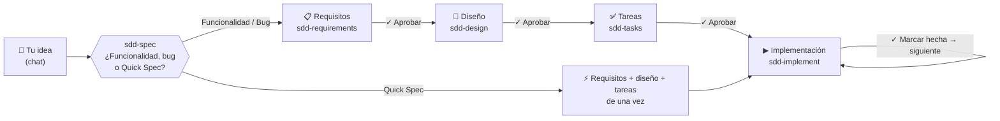
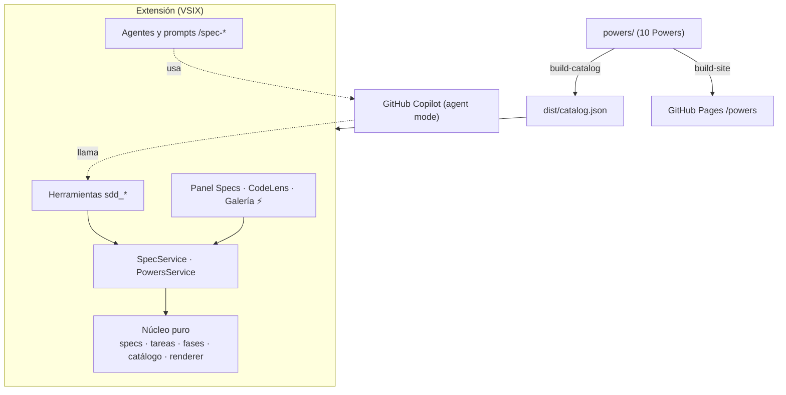

<p align="center">
  
</p>

<h1 align="center">SDD Studio</h1>

<p align="center">
  <b>Spec-Driven Development estilo Kiro, dentro de VS Code.</b><br>
  Requisitos → diseño → tareas, con tu aprobación en cada paso. La IA la pone GitHub Copilot.
</p>

<p align="center">
  <a href="https://github.com/enriquecordero/sdd-studio/releases/latest"></a>
  <a href="https://github.com/enriquecordero/sdd-studio/actions/workflows/ci.yml"></a>
  <a href="LICENSE.md"></a>
  
  
</p>

<p align="center">
  <a href="https://enriquecordero.github.io/sdd-studio/"><b>🌐 Landing</b></a> ·
  <a href="https://enriquecordero.github.io/sdd-studio/powers/"><b>⚡ Catálogo de Powers</b></a> ·
  <a href="https://github.com/enriquecordero/sdd-studio/releases/latest"><b>⬇️ Descargar el .vsix</b></a>
</p>

<p align="center">
  
</p>

---

## ✨ ¿Qué es?

- **Specs como en Kiro, sin cambiar de editor.** Escribes tu idea en el chat y SDD Studio la convierte en `requirements.md` → `design.md` → `tasks.md`, y luego en código, tarea por tarea.
- **Tú apruebas cada fase.** Nada avanza sin tu clic, y las aprobaciones las aplica la extensión con código, no el modelo.
- **100 % GitHub Copilot.** Usa los modelos de tu plan (también Business o Enterprise) mediante custom agents, prompt files, skills y herramientas de extensión, todas funciones GA. Sin backend propio.
- **Powers.** Una galería de skills populares de la comunidad (TDD, debugging, code review…) adaptados a Copilot, que activas por repo con un clic.

## 🧭 Cómo funciona



1. Pulsa **+ Nuevo spec** en el panel ⚡, o elige el agente **`sdd-spec`** en Copilot Chat, y escribe tu idea, por ejemplo *"quiero hacer el juego de Snake"*.
2. `sdd-spec` te pregunta el tipo con una **tarjeta** (*Construir una funcionalidad*, *Arreglar un bug* o *Quick Spec*), elige el nombre del spec y delega en **subagentes**.
3. Revisa cada documento y apruébalo con el botón del chat, la CodeLens **✓ Aprobar y continuar** o el panel.
4. En `tasks.md`, pulsa **▶ Ejecutar tarea**. `sdd-implement` escribe el test primero, implementa y verifica. Luego pulsa **✓ Marcar hecha → siguiente**.

<p align="center">
  <br>
  <sub>Ilustración del flujo: panel Specs, CodeLens sobre cada tarea y Copilot con el agente correcto.</sub>
</p>

<table>
<tr>
<td width="320"></td>
<td>

**El panel ⚡ SDD Studio** (captura real):

- **Nuevo spec**, y tus specs con su fase o su progreso (*6/6 tareas*).
- **Steering**: las instrucciones `product`, `tech` y `structure` de Copilot.
- **Powers**: la galería y los Powers activos en el repo.
- En la barra de título: crear, refrescar, **Diagnóstico** y la galería de Powers.

</td>
</tr>
</table>

### 🤖 Los agentes

| Agente | Qué hace | Botón al terminar |
|---|---|---|
| `sdd-spec` | Punto de entrada: pregunta el tipo, elige el nombre y orquesta subagentes | ✓ Aprobar requisitos → Diseño |
| `sdd-requirements` | Requisitos con historias y criterios **EARS** (`WHEN … THE SYSTEM SHALL …`), o `bugfix.md`. Wireframes ASCII si hay interfaz | ✓ Aprobar requisitos → Diseño |
| `sdd-design` | Arquitectura, interfaces, datos, errores y tests, con diagramas ASCII | ✓ Aprobar diseño → Tareas |
| `sdd-tasks` | Tareas pequeñas trazadas a los requisitos (`_Requisitos: 1.1_`) | ✓ Aprobar tareas → Implementar |
| `sdd-implement` | Una tarea por vez: test primero, código mínimo, verificación real | ✓ Marcar hecha → siguiente |
| `sdd-steering` | Genera `product`, `tech` y `structure` en `.github/instructions/` | — |

Los agentes de requisitos, diseño y tareas **no pueden tocar tu código**: solo escriben documentos de spec mediante la herramienta `sdd_writeSpecDoc`.

### 💬 Atajos en el chat

| Comando | Para qué |
|---|---|
| `/spec-new <idea>` | Spec de funcionalidad |
| `/spec-bugfix <qué falla>` | Spec de bug (bug actual → esperado → regresión) |
| `/spec-quick <idea>` | Quick Spec: todo de una vez, listo para implementar |
| `/spec-run <spec> <tarea>` | Ejecuta una tarea concreta |
| `/spec-steering` | Genera o actualiza el steering del proyecto |

## ⚡ Powers

Skills populares de la comunidad, **adaptados a GitHub Copilot** y presentados con una infografía. Cada Power se instala en `.github/skills/<id>/` de tu repo (con su `LICENSE`) y queda registrado en `.github/powers.lock.json`, así que tu equipo lo recibe por git.

<p align="center">
  
</p>

| | Power | Categoría | Autor original | Se activa |
|---|---|---|---|---|
| 🧪 | [TDD](https://enriquecordero.github.io/sdd-studio/powers/tdd.html) | Testing | Matt Pocock | Automático ("implementa…", "con TDD") |
| 🐞 | [Debugging sistemático](https://enriquecordero.github.io/sdd-studio/powers/systematic-debugging.html) | Debugging | Jesse Vincent (superpowers) | Automático ("falla…", "error") |
| ✅ | [Verificación](https://enriquecordero.github.io/sdd-studio/powers/verification.html) | Testing | Jesse Vincent (superpowers) | Automático ("ya está", "listo") |
| 🔥 | [Grill Me](https://enriquecordero.github.io/sdd-studio/powers/grill-me.html) | Planificación | Matt Pocock | **`/grill-me`** |
| 🧪 | [Prototype](https://enriquecordero.github.io/sdd-studio/powers/prototype.html) | Planificación | Matt Pocock | Automático ("haz un prototipo") |
| 📚 | [Research](https://enriquecordero.github.io/sdd-studio/powers/research.html) | Investigación | Matt Pocock | Automático ("investiga…") |
| 🧭 | [Domain Modeling](https://enriquecordero.github.io/sdd-studio/powers/domain-modeling.html) | Arquitectura | Matt Pocock | Automático ("escribe un ADR") |
| 🔍 | [Code Review](https://enriquecordero.github.io/sdd-studio/powers/code-review.html) | Testing | Matt Pocock | Automático ("revisa este PR") |
| 🧱 | [Codebase Design](https://enriquecordero.github.io/sdd-studio/powers/codebase-design.html) | Arquitectura | Matt Pocock | Automático ("diseña la interfaz") |
| 🥔 | [Poteto Mode](https://enriquecordero.github.io/sdd-studio/powers/poteto-mode.html) | Modos | Lauren Tan (pstack) | **`/poteto-mode`** |

<table>
<tr>
<td width="460"></td>
<td>

**Cada Power tiene su póster:**

- **Se activa cuando dices:** las frases que lo cargan.
- **El método:** un diagrama (ciclo, pasos, embudo o dos columnas).
- **Obtienes:** los beneficios.
- **Origen:** repo, autor y licencia, con enlace al commit exacto.

**Usarlos:** panel ⚡ → Powers → **Abrir galería…** → **+ Activar en este repo**.
**Actualizar:** **Buscar actualizaciones** (opcional; sin red se usa el catálogo incluido). Si editaste un skill a mano, SDD Studio pregunta antes de sobrescribirlo o borrarlo.

</td>
</tr>
</table>

> Formato abierto **Agent Plugins 1.0**: los Powers también sirven en Kiro, Cursor o Claude Code copiando la carpeta del skill. Cada página del [catálogo](https://enriquecordero.github.io/sdd-studio/powers/) explica cómo.

## 📦 Instalar

```bash
# 1. Descarga el último .vsix
gh release download --repo enriquecordero/sdd-studio --pattern '*.vsix'
# 2. Instálalo
code --install-extension sdd-studio-*.vsix
```

Luego recarga VS Code (`Cmd/Ctrl+Shift+P` → *Developer: Reload Window*) y ejecuta **SDD Studio: Diagnóstico**.

**Requisitos:**
- VS Code **1.140** o superior.
- **GitHub Copilot Chat** con sesión iniciada y **agent mode** habilitado.
- Workspace marcado como de confianza, para crear specs, ejecutar tareas y activar Powers.

<details>
<summary><b>🩺 Diagnóstico y políticas de empresa</b></summary>

**SDD Studio: Diagnóstico** comprueba la versión de VS Code, Copilot Chat, la sesión de GitHub, agent mode y que las herramientas de extensión estén permitidas. Si tu organización activa la política `ChatStrictPluginOnlyCustomization`, avisa de que Copilot puede ignorar el steering y los Powers del repo, y te dice qué pedir a TI.

</details>

<details>
<summary><b>⚙️ Configuración</b></summary>

| Setting | Por defecto | Para qué |
|---|---|---|
| `sddStudio.specsFolder` | `specs` | Carpeta de los specs |
| `sddStudio.language` | `es` | Idioma en que los agentes redactan (`es` / `en`). Las palabras clave EARS siempre van en inglés |

</details>

## 📝 Formato de los specs

Todo es Markdown legible y versionado con tu código, en `specs/<feature>/`. El estado vive en el front matter y en las casillas: no hay bases de datos ni archivos ocultos.

<details>
<summary><b>requirements.md (EARS)</b></summary>

```markdown
---
status: approved
approvedAt: 2026-10-01T10:00:00.000Z
---
### Requisito 1: Exportar pedidos
**Historia:** Como admin, quiero exportar pedidos a CSV, para analizarlos.
#### Criterios de aceptación
1. WHEN el admin pulsa "Exportar" THE SYSTEM SHALL generar el CSV.
2. IF hay más de 50k filas THEN THE SYSTEM SHALL generarlo en segundo plano.
3. THE SYSTEM SHALL NOT incluir datos de tarjeta.
```

</details>

<details>
<summary><b>tasks.md</b></summary>

```markdown
# Plan de implementación — export-csv

- [x] 1. Consulta de pedidos con filtros
  - _Requisitos: 1.1_
- [-] 2. Generación del CSV
  - [x] 2.1 Serializador sin datos de tarjeta
    - _Requisitos: 1.3_
  - [ ] 2.2 Trabajo en segundo plano
    - _Requisitos: 1.2_
- [ ]* 3. Métricas de uso
```

`[ ]` pendiente · `[-]` en curso · `[x]` hecha · `[ ]*` opcional · `_Requisitos_` = trazabilidad

</details>

## 🛠️ Para desarrolladores



| Script | Qué hace |
|---|---|
| `npm run build` | Genera el catálogo y empaqueta la extensión con esbuild |
| `npm run test:unit` | Tests unitarios (vitest) |
| `npm run test:integration` | Tests dentro de VS Code (`@vscode/test-electron`) |
| `npm run build:catalog -- --check` | Valida los Powers: esquema, licencias, términos sin adaptar |
| `npm run build:site` | Genera la web (landing + `/powers`) en `_site/` |
| `npm run package` | Genera el `.vsix` |

- **CI:** cada PR ejecuta lint, typecheck, tests, validación del catálogo y build de la web.
- **Release:** al subir un tag `vX.Y.Z` se publica el `.vsix` en Releases.
- **Pages:** cada push a `main` publica la landing y `/powers`.

<details>
<summary><b>➕ Añadir un Power</b></summary>

```
powers/<id>/
  plugin.json          Agent Plugins 1.0 (name, version, description, author, license)
  presentation.json    tarjeta y póster: icono, categoría, triggers, diagrama, beneficios, origen
  skills/<id>/SKILL.md el skill adaptado a Copilot (+ archivos de apoyo)
  LICENSE              licencia original
  UPSTREAM.md          repo, commit de origen y lista de cambios
```

`npm run build:catalog -- --check` te dice exactamente qué falta.

</details>

Más documentación: [`docs/spec.md`](docs/spec.md) (spec del flujo SDD), [`docs/superpowers/specs/`](docs/superpowers/specs/) (spec de Powers), [`docs/manual-checklist.md`](docs/manual-checklist.md) y [`docs/follow-ups.md`](docs/follow-ups.md).

## 🙏 Créditos y licencia

- **Powers:** [mattpocock/skills](https://github.com/mattpocock/skills) (Matt Pocock), [obra/superpowers](https://github.com/obra/superpowers) (Jesse Vincent) y [cursor/plugins · pstack](https://github.com/cursor/plugins) (Lauren Tan), todos MIT. Avisos completos en [`NOTICE`](NOTICE).
- **Tema SDD Studio Dark:** basado en [Kiro Theme](https://github.com/BioHazard786/kiro-theme-vscode) (MIT).
- Proyecto independiente, inspirado en el flujo de specs de Kiro. Sin afiliación con AWS ni Kiro.
- Licencia [MIT](LICENSE.md) © 2026 Enrique Cordero.
